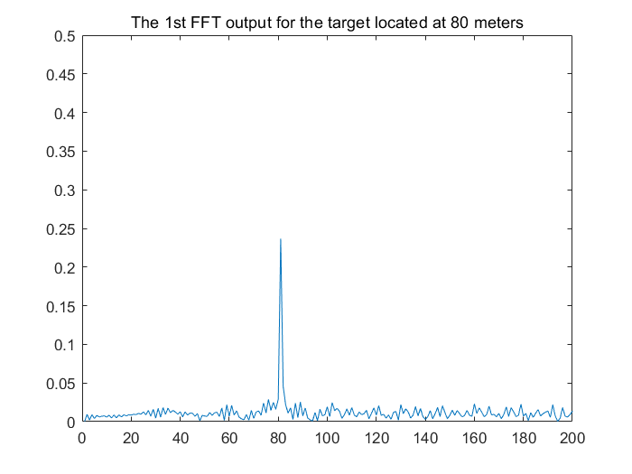
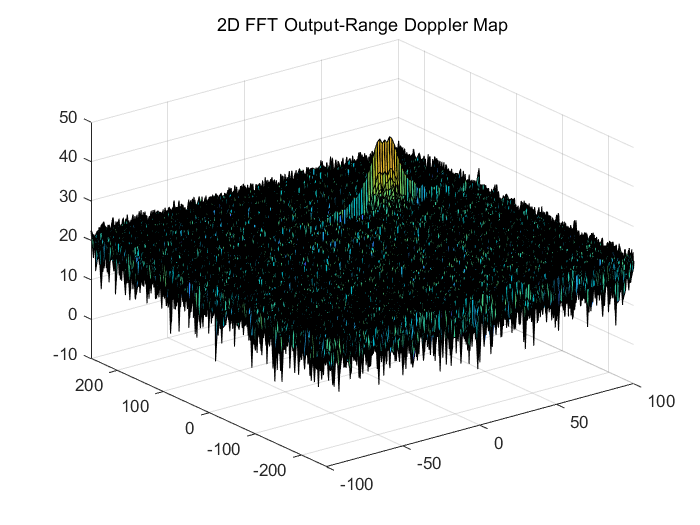
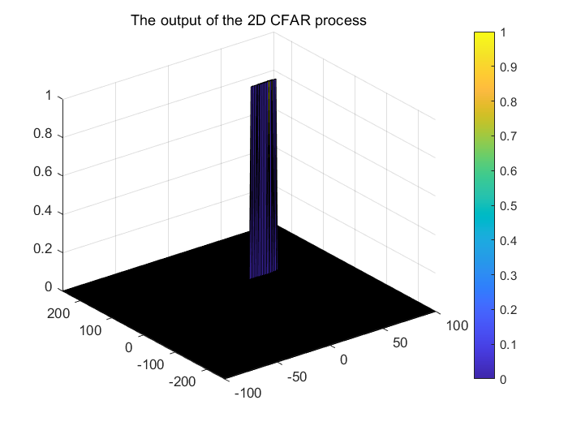

# Radar_Target_Generation_and_Detection
Using Matlab simulate Radar to detected target object

## Radar_Target_Generation_and_Detection


This Project taking about how Radar detection object' position and velocity;We will use matlab simulation radar to detect the target object.It will be done in the following steps: 

- **Radar System Requirements.**
- **Initial Range and velocity of the Target.**
- **Configure the FMCW waveform based on the system requirements.**  
- **Modeling singal propagation for the moving Target scenario**  
- **Perform Range FFT on the received signal to determine the Range.**  
- **Towards the end, perform the CFAR processing on the output of 2nd FFT to display the target.**  


#### 1.  Radar System Requirements


System Requirements defines the design of a Radar. The sensor fusion design for different driving scenarios requires different system configurations from a Radar. In this project, we designing a Radar based on the given system requirements (above).  

` Max_Range = 200; `  
`Max_velocity = 100;`  
`Speed_of_light = 3e8;`  
`Range_Resolution = 1; `

#### 2.  Initial Range and velocity of the Target  

Define the initial range and velocity of the target.  

`Range_of_target = 80;`  
`Velocity_of_target = 40;`

#### 3. Configure the FMCW waveform based on the system requirements.

Now we have the parameters of the radar; Next we will design the FMCW waveform by giving the specs of each of its parameters.

- BandWdith  
`BandWdith = Speed_of_light / (2 * Range_Resolution);`  
- Chirp Time  
`T_chirp = 5.5*2*Max_Range / Speed_of_light;`  
- Slope  
`Slope = BandWdith / T_chirp;` 
- Operating carrier frequency of Radar  
`fc=77e9;`  
- The number of chirps in one sequence.  
`Nd=128;`  
- The number of samples on each chirp.   
`Nr = 1024;`  
- Timestamp for running the displacement scenario for every sample on each chirp  
`t=linspace(0, Nd*T_chirp, Nr*Nd)`  
- Creating the vectors for Tx, Rx and Mix based on the total samples input.  
`Tx = zeros(1,length(t));`  
`Rx = zeros(1,length(t));`  
`Mix = zeros(1,length(t));`  

- Similar vectors for range_covered and time delay.   
`r_t=zeros(1,length(t));`  
`td=zeros(1,length(t));`


#### 4.  Modeling singal propagation for the moving Target scenario 


Next, we will be simulating the signal propagation and moving target scenario.  
In terms of wave equation, FMCW transmit and received signals are defined using these wave equations, where **a = Slope of the signal**. The Transmit Signal is given by:  

$$ Tx = cos(2\pi(f_ct+ \frac{\alpha t^2}{2} )) $$  

The received signal is nothing but the time delayed version of the Transmit Signal. In digital signal processing the time delayed version is defined by $(t - \tau )$, where $\tau$ represents the delay time, which in radar processing is the trip time for the signal.  
$$ Rx = cos(2\pi(f_c(t-\tau)+ \frac{\alpha (t-\tau)^2}{2} )) $$  

On mixing these two signals, we get the beat signa. The beat signal can be calculated by multiplying the Transmit signal with Receive signal. This process in turn works as frequency subtraction. It is implemented by element by element multiplication of transmit and receive signal matrices.

$$ Tx. * Rx = cos(2\pi(\frac{2\alpha R}{c}t + \frac{2f_c vn}{c}t) $$  


```
for i=1:length(t)        
    
    %For each time stamp update the Range of the Target for constant velocity. 
    
    r_t(i) = Range_of_target + Velocity_of_target*t(i);
    td(i) = (2 * r_t(i))/Speed_of_light;
    
    %For each time sample we need update the transmitted and received signal. 
    
    Tx(i) = cos(2*pi*(fc*t(i))+(0.5 * Slope * t(i)^2));
    Rx (i)  = cos(2*pi*(fc*(t(i)-td(i))) + (0.5*Slope*(t(i)-td(i))^2));
    
    %Now by mixing the Transmit and Receive generate the beat signal
    %This is done by element wise matrix multiplication of Transmit and
    %Receiver Signal
    
    Mix(i) = Tx(i)*Rx(i);
    
end
```

#### 5. FFT Operation  

Now, we get the beat signal, which holds the values for both range as well as doppler. By implementing the 2D FFT on this beat signal, we can extract both Range and Doppler information.  

First, Implement the 1D FFT on the Mixed Signal:

- Reshape the vector into Nr*Nd array. Nr and Nd here would also define the size of Range and Doppler FFT respectively.  
`Mix = reshape(Mix, [Nr, Nd]);`  
- run the FFT on the beat signal along the range bins dimension (Nr) and normalize.  
`sig_fft1 = fft(Mix, Nr);`  
`sig_fft1 = sig_fft1/Nr;`  
- Take the absolute value of FFT output.  
`sig_fft1 = abs(sig_fft1);`  
- Output of FFT is double sided signal, but we are interested in only one side of the spectrum.  
`single_side_sig_fft1 = sig_fft1(1:Nr/2);
`  
- plotting the range  
`figure ('Name','Range from First FFT')`  
`plot(single_side_sig_fft1);`  
`title('The 1st FFT output for the target located at 80 meters')`  
`axis ([0 200 0 0.5]);`  

- Result : 



#### 6. RANGE DOPPLER RESPONSE

Next， we will run a 2DFFT on the mixed signal(beat signal) output and generate a ranger doppler map.

- The output of the 2D FFT is an image that has reponse in the range and doppler FFT bins. So, it is important to convert the axis from bin sizes to range and doppler based on their Max values.  
`Mix=reshape(Mix,[Nr,Nd]);
`
- 2D FFT using the FFT size for both dimensions.  
`sig_fft2 = fft2(Mix,Nr,Nd);`

- Taking just one side of signal from Range dimension.  
`sig_fft2 = sig_fft2(1:Nr/2,1:Nd);`  
`sig_fft2 = fftshift (sig_fft2);`  
`RDM = abs(sig_fft2);`  
`RDM = 10*log10(RDM) ;`  

- use the surf function to plot the output of 2DFFT and to show axis in both dimensions.  
`doppler_axis = linspace(-100,100,Nd);`  
`range_axis = linspace(-200,200,Nr/2)*((Nr/2)/400);`  
`figure,surf(doppler_axis,range_axis,RDM);`  



#### 7. Perform the CFAR processing on the output of 2nd FFT to display the target  

Radar not only receive the reflected signals from the objects of interest, but also from the environment and unwanted objects. The backscatter from these unwanted sources is called as clutter.

It is important to filter out clutter for successful detection of targets. This is critical in a driving scenario to avoid the car from suddenly braking in the absence of valid targets. This sudden braking happens when the radar detects reflections that are generated from the clutter.

Next, we will useing a dynamic thresholding technique called CFAR (Constant False Alarm Rate). With this technique, the noise at every or group of range/doppler bins is monitored and the signal is compared to the local noise level. This comparison is used create a threshold which holds the false alarm rate constant.


CFAR implementation
- Select the number of Training Cells in both the dimensions.  
`Tr = 10;`  
`Td = 8;`  
- Select the number of Guard Cells in both dimensions around the Cell under test (CUT) for accurate estimation.  
`Gr = 4;`  
`Gd = 4;`  
- Offset the threshold by SNR value in dB  
`offset = 1.2;`  
- Normalization RDM  
`RDM = RDM/max(max(RDM));`  
- Design a loop such that it slides the CUT across range doppler map by giving margins at the edges for Training and Guard Cells.
- For every iteration sum the signal level within all the training cells.
- To sum convert the value from logarithmic to linear using db2pow function.
- Average the summed values for all of the training cells used.
- After averaging convert it back to logarithimic using pow2db.
- Further add the offset to it to determine the threshold.
- Last, compare the signal under CUT with this threshold. If the CUT level > threshold assign it a value of 1, else equate it to 0.

```
for i = Tr + Gr +1:(Nr/2)-(Gr+Tr)
    for j = Td + Gd + 1:Nd-(Gd+Td)  
        
        %Create a vector to store noise_level for each iteration on training cells
        noise_level = zeros(1,1);
        
        %calculate noise sum in the area around CUT
        for row = i-(Tr+Gr):i+(Tr+Gr)
            for col = j-(Td+Gd):j+(Td+Gd)
                if(abs(i-row) > Gr || abs(j-col)>Gd)
                    noise_level = noise_level + db2pow(RDM(row, col));
                end
            end
        end
        
        % Calculate threshould from noise average then add the offset
        threshold = pow2db(noise_level/(2*(Td+Gd+1)*2*(Tr+Gr+1)-(Gr*Gd)-1));
        threshold = threshold + offset;
        CUT = RDM(i, j);
        
        if(CUT < threshold)
            RDM(i, j) = 0;
        else
            RDM(i, j) = 1;
        end
    end
end
```

- The process above will generate a thresholded block, which is smaller than the Range Doppler Map as the CUT cannot be located at the edges of matrix. Hence,few cells will not be thresholded. To keep the map size same set those values to 0.  
`RDM(union(1:(Tr+Gr),end-(Tr+Gr-1):end),:) = 0;`  
`RDM(:,union(1:(Td+Gd),end-(Td+Gd-1):end)) = 0;`  


- Display the CFAR output using the Surf function like we did for Range Doppler Response output.  
`figure('Name','CA-CFAR Filtered RDM')`  
`surf(doppler_axis,range_axis,RDM);`  
`title('The output of the 2D CFAR process');`  
`colorbar;`




